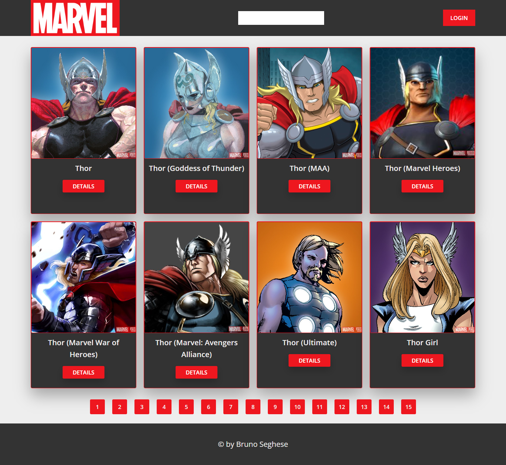
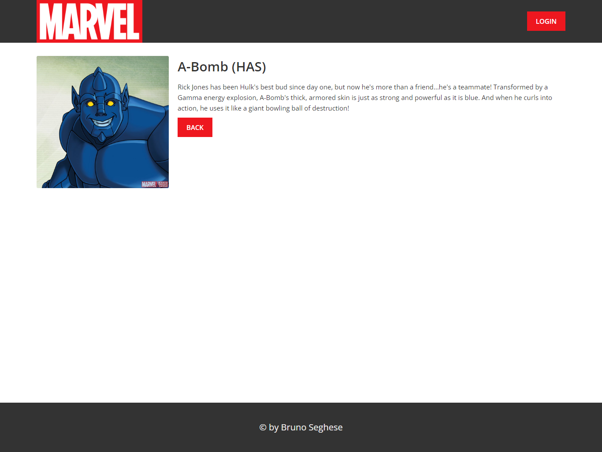

# Tech test to integrate the iVera Team 🏡

### ​👷‍♂️​ Acessar o Projeto

◽ Clonar o repositório:

```
git clone https://github.com/brseghese/ivera-fullstack-test.git
```

◽ Instalar dependências:

```
npm install
```

◽ Criar arquivo `config.env` na raiz do projeto e definir as variáveis:

```
NODE_ENV=development
PORT=3000

DATABASE=******
DATABASE_PASSWORD=******

JWT_SECRET=******
JWT_EXPIRES_IN=90d
JWT_COOKIE_EXPIRES_IN=90

MARVEL_PUBLIC_KEY=******
MARVEL_PRIVATE_KEY=******
```

[MongoDb](https://www.mongodb.com/) | [JWT](https://jwt.io/libraries) | [Marvel Api](https://developer.marvel.com/documentation/getting_started)

◽ Executar o script:

```
npm run start
```

---

## Funcionalidades Backend

### Acesse aqui o [Postman](https://documenter.getpostman.com/view/21383137/2s8YeprC8R) para ver a documentação.

🔴 A route to create admin users;

Cadastrar novo usuario:

```
http://127.0.0.1:3000/api/v1/user

{
    "name": "Usuário",
    "email": "user@ivera.com",
    "password": "12345678",
    "passwordConfirm": "12345678",
    "role": "user"
}
```

- Administrador = `"role": "admin"`
- Usuário: `"role": "user"`

Para cadastrar usuário é preciso estar logado como administrador.

Use o email e a senha abaixo no endpoint de login para logar:

- email: `admin@ivera.com`
- senha: `12345678`

Obs. a senha é salva no banco criptografada.

---

🔴 A route to login with admin users (Use the login method that you prefer);

Login:

```
http://127.0.0.1:3000/api/v1/login

{
    "email": "usuario@ivera.com",
    "password": "12345678"
}
```

[JSON Web Tokens](https://jwt.io/) usado como método de login.

---

🔴 A route of character list, accepting parameters of filters and pagination;

```
http://127.0.0.1:3000/api/v1/characters
```

Parametros:

`&limit=20` : limita a paginação em 20; <br>
`&offset=20` : avança 20 personagens para a próxima página; <br>
`&nameStartsWith` : pesquisa por nome do personagem;

🔴 A route of **character details**, taking the character id as a parameter;

```
http://127.0.0.1:3000/api/v1/characters/id
```

---

🔴 A **middleware for log requests**, containing request method, url and parameters saved; <br>

🔴 A route (authenticated only admin users) of **history**, containing all the log requests saved on MongoDB (No need front-end, only back-end call. Only admin profile)

```
http://127.0.0.1:3000/api/v1/logs
```

Para acessar essa rota é preciso estar logado como administrador.

---

## Funcionalidades Frontend

🔴 A page of **character list**, using parameters, filters and pagination created before;

🔴 A page of **character details**, that shows all info returned from the backend by clicking on a character on the list created before;

Com a aplicação em execução, abra http://localhost:3000 no seu navegador para ver a aplicação.

🟢 SITE RESPONSIVO

---

Preview:

<div align="center">

</div>

<br>

<div align="center">

</div>

---

> Desenvolvido com ❤️ por **Bruno Seghese**

---

## Tech test to integrate the iVera Team 🏡


<br>

## Create a Rest API and a SPA that consumes and shows the official [Marvel Comics API](https://developer.marvel.com/docs).

## :computer: Functionalities (Back-end)

🔴 A route to create admin users;<br>
🔴 A route to login with admin users (Use the login method that you prefer);<br>
🔴 A route of **character list**, accepting parameters of filters and pagination;<br>
🔴 A route of **character details**, taking the character id as a parameter;<br>
🔴 A **middleware for log requests**, containing request method, url and parameters saved;<br>
🔴 A route (authenticated only admin users) of **history**, containing all the log requests saved on MongoDB (No need front-end, only back-end call. Only admin profile)

## :computer: Functionalities (Front-end)

🔴 A page of **character list**, using parameters, filters and pagination created before;<br>
🔴 A page of **character details**, that shows all info returned from the backend by clicking on a character on the list created before;<br>

## Technologies and tools you have to use:

☑️ Javascript ES6+ <br>
☑️ Nodejs <br>
☑️ MongoDB <br>
☑️ Any front-end framework/library (feel free to use [Vuejs](https://vuejs.org/), [Reactjs](https://reactjs.org/), [EJS](https://ejs.co/) or any other 🚀) <br>
☑️ Express (for the back-end) <br>
☑️ Be free to use any other tools/tecs if you need <br>

## Start instructions

- Create a fork of this project
- Do all the tasks to complete the application
- Create a README.md showing the steps to run the application
- Make a merge request on the main branch
- Send us the link of the merge request

---
